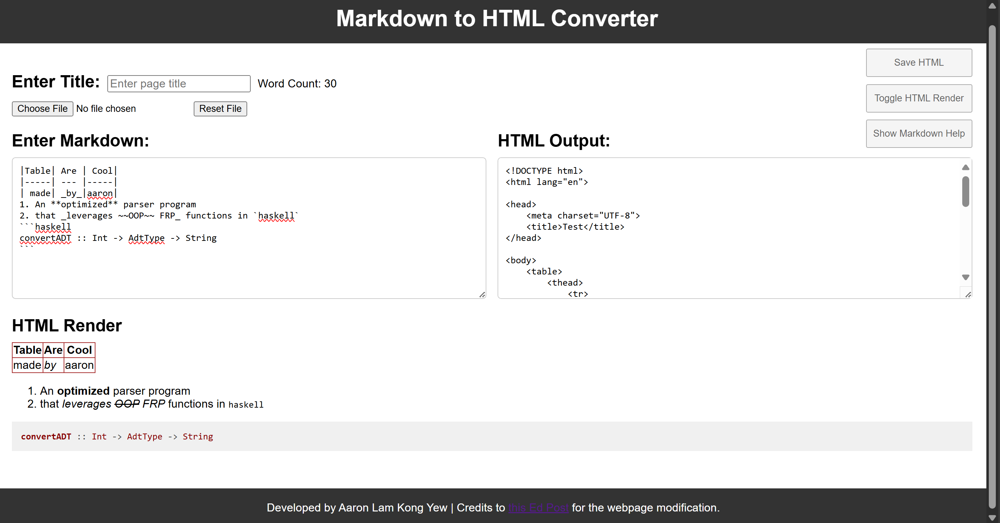
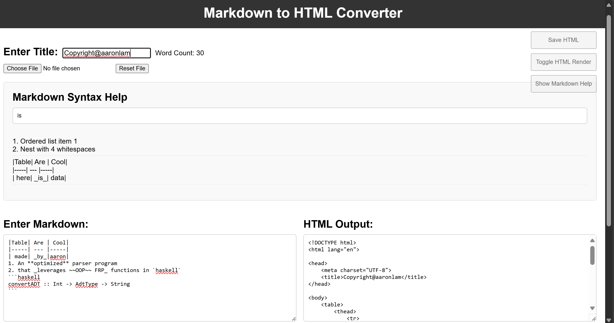
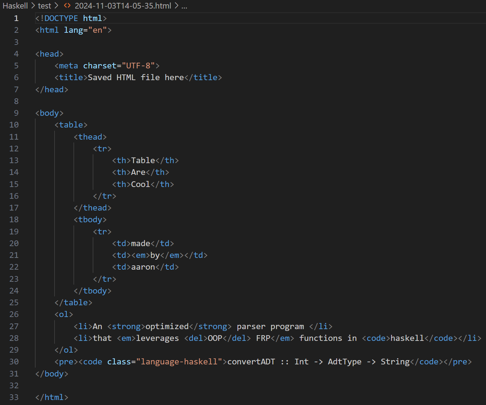

# Markdown2HTML

Author: **Aaron**

This repository harnesses the power of Haskell and TypeScript to create a **Markdown Parser** using Functional Reactive Programming. Users are able to create their own HTML files by typing, or upload any scaffold markdown file, make changes to it, and parse it into HTML-documented format.
All input in the markdown file is parsed and automatically converted into HTML format. The HTML file is then displayed on the right side of the webpage.
This program includes features such as:
1. Nested collection of Text Modifiers
2. Evenly-spaced Tables (hard mode)
3. Select and open markdown files
4. Markdown Help Library
5. Trivial Word Count

For more information, refer to [Documentation](./Documentation.pdf)








## Running the Code

```
$ stack test
```

This will generate the HTML files using the sample input markdown files, by running your code for each exercise.

All example markdown files are stored within `examples/input` and the output of your parser will be saved in `examples/output`.


## Running the Interactive Page

In the Haskell folder run:

```
$ stack run
```

In a separate terminal, in the javascript folder run:

```
$ npm i
$ npm run dev
```

You can type markdown in to the LHS of the webpage and inspect the converted HTML.


## Disclaimer
Monash University holds copyright for code inside the `Haskell/src/Instances` and `Haskell/src/Parser` files


## CFG in BNF for Markdown
```Markdown
<ADT>                ::= "[" <AdtTypeList> "]"

<AdtTypeList>        ::= <AdtType>
                      |  <AdtType> "," <AdtTypeList>

<AdtType>            ::= <Image>
                      |  <FootnoteReference>
                      |  <Heading>
                      |  <Blockquote>
                      |  <CodeBlock>
                      |  <OrderedListADT>
                      |  <Table>
                      |  <EmptyLineADT>
                      |  <FreeTextADT>

<Heading>            ::= <HashHeading>
                      |  <AlternativeHeading>
<HashHeading>        ::= <inlineSpace> <Hashes> " " <FreeText>
<AlternativeHeading> ::= <inlineSpace> <FreeText> <HeadingLevel> "\n"
<Hashes>             ::= "#" | "##" | "###" | "####" | "#####" | "######"
 
<HeadingLevel>       ::= <inlineSpace> <EqualsLevel>
                      |  <inlineSpace> <DashLevel>
<EqualsLevel>        ::= "==" <EqualsLevelTail>
<DashLevel>          ::= "--" <DashLevelTail>
<EqualsLevelTail>    ::= "=" <EqualsLevelTail>
                      |  ""
<DashLevelTail>      ::= "-" <DashLevelTail>
                      |  ""

<OrderedListADT>             ::= <OrderedList>
<OrderedList>                ::= <FirstOrderedListItem> <SubsequentOrderedListItems>
<FirstOrderedListItem>       ::= "1. " <FreeText> <OptionalSubList>
<SubsequentOrderedListItems> ::= ""
                              |  <OrderedListItem> <SubsequentOrderedListItems>
<OrderedListItem>            ::= <Digits> ". " <FreeText> <OptionalSubList>
<OptionalSubList>            ::= ""
                              |  <SubOrderedList>
<SubOrderedList>             ::= <FirstSubOrderedListItem> <SubsequentSubOrderedListItems>
<FirstSubOrderedListItem>    ::= "    " <FirstOrderedListItem>
<SubsequentSubOrderedListItems> ::= ""
                              |  <SubOrderedListItem> <SubsequentSubOrderedListItems>
<SubOrderedListItem>         ::= "    " <OrderedListItem>

<Blockquote>         ::= <inlineSpace> ">" <FreeText>
                      |  <inlineSpace> ">" <FreeText> <Blockquote>

<Table>              ::= <TableRow> <SeparatorRow> <TableRows>
<TableRow>           ::= <inlineSpace> "|" <TableCells> "|" "\n"
<TableCells>         ::= <CellContent>
                      |  <CellContent> "|" <TableCells>
<CellContent>        ::= <inlineSpace> <FreeText> <inlineSpace>
<SeparatorRow>       ::= <inlineSpace> "|" <SeparatorCells> "|" "\n"
<SeparatorCells>     ::= <SeparatorCell>
                      |  <SeparatorCell> "|" <SeparatorCells>
<SeparatorCell>      ::= <inlineSpace> "---" <DashLevelTail> <inlineSpace>
<TableRows>          ::= <TableRow>
                      |  <TableRow> <TableRows>

<FootnoteReference>  ::= <FootnoteNumber> ":" <String>

<Image>              ::= ""

<CodeBlock>          ::= <inlineSpace> "```" <String> "\n" <String> "\n```\n" 

<FreeTextADT>        ::= <FreeText> "\n"

<FreeText>           ::= "[" <FreeTextorModifierList> "]"
<FreeTextorModifierList> ::= <FreeTextorModifier>
                           |  <FreeTextorModifier> "," <FreeTextorModifierList>
<FreeTextorModifier> ::= <FreeTextChunk>
                      |  <TextModifier>
<FreeTextChunk>      ::= <String>
<TextModifier>       ::= <Italic>
                      |  <Bold>
                      |  <Strikethrough>
                      |  <Link>
                      |  <InlineCode>
                      |  <Footnote>
<Italic>             ::= "_" <FreeText> "_"
<Bold>               ::= "**" <FreeText> "**"
<Strikethrough>      ::= "~~" <FreeText> "~~"
<Link>               ::= "[" <FreeText> "](" <String> ")"
<InlineCode>         ::= "`" <FreeText> "`"
<Footnote>           ::= <FootnoteNumber>
<FootnoteNumber>     ::= <inlineSpace> "[^" <PositiveInt> "]"

<EmptyLineADT>       ::= <inlineSpace> "\n"
<inlineSpace>        ::= ""
                      |  " "
                      |  " " <inlineSpace>

<String> ::= <Char> | <Char> <String>
<Char> ::= "a" | ... | "z" | "A" | ... | "Z" | "0" | "1" | "2" | ... | "9" | " " | "!" | ... | "~"

<PositiveInt> ::= < PositiveDigit> | < PositiveDigit > <Digits>
<Digits> ::= <Integer> | <Integer> <Digits>
<PositiveDigit> ::= "1" | "2" | "3" | "4" | "5" | "6" | "7" | "8" | "9"
<Integer> ::= "0" | <PositiveDigit>
```
